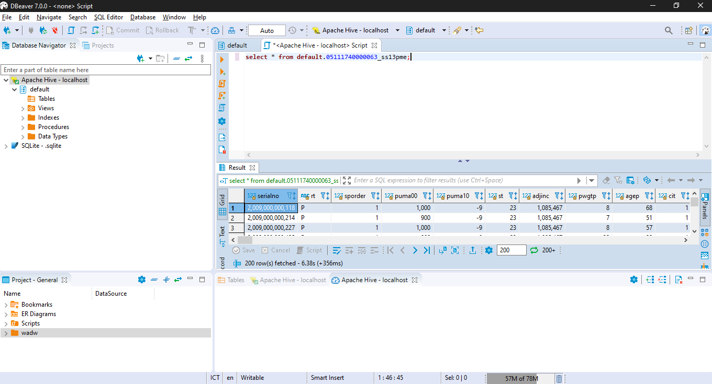
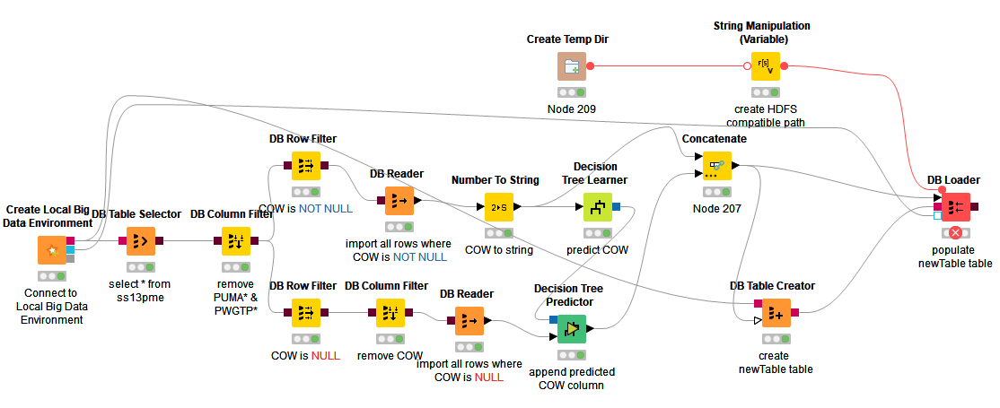
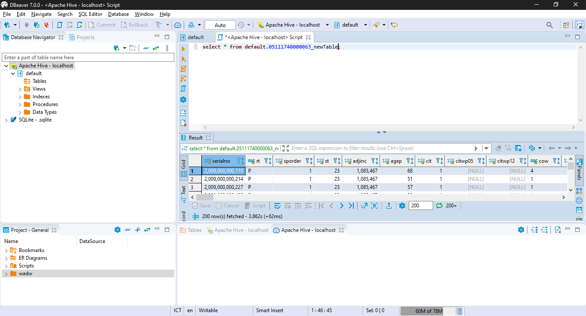

# BIG DATA - KNIME

* DB

    1. Download exercise 1-4 ([04_WritingToDB](https://hub.knime.com/knime/spaces/Education/latest/04%20KNIME%20Big%20Data%20Course/1_DB/2_Exercises/)).
    1. Download file [newCensus.sqlite](https://hub.knime.com/knime/spaces/Education/latest/04%20KNIME%20Big%20Data%20Course/1_DB/1_Data/).

    ## 01_DB_Connect_Exercise

    1. Tambahkan SQlite Connector
        * atur agar sqlite file menjadi sqlite yang telah didownload
    2. Tambahkan DB Table selector
        * pilih table ss13pme
    3. Tambahkan DB Reader
    4. execute

    final workflow:
    

    ## 02_DB_InDB_Processing_Exercise

    1. Tambahkan DB Column Filter
        * atur table ss13pme sebagai input
        * atur kolom puma* dan pwgtp* agar tereksklusi
    2. Tambahkan DB Joiner
        * atur mode menjadi inner join
        * atur DB Column filter dan tabel ss13hme sebagai input
    3. Tambahkan DB Reader
        * atur DB Joiner sebagai input
    4. Tambahkan DB Row Filter
        * atur DB Column Filter sebagai input
        * atur kondisinya menjadi cow is null
        * tambahkan DB Reader untuk membaca hasil
    5. Tambahkan DB Row Filter
        * atur DB Column Filter sebagai input
        * atur kondisinya menjadi cow is **not** null
        * tambahkan DB Reader untuk membaca hasil
    6. Tambahkan DB GroupBy
        * atur DB Column Filter sebagai input
        * atur sex sebagai group column
        * tambahkan manual aggregation untuk kolom agep dgn agregasi average
        * tambahkan manual aggregation untuk kolom agep dgn agregasi kustom (AVG(#COLUMN_NAME# + #SECOND_COLUMN_NAME#))
        * tambahkan DB Reader untuk membaca hasil
    7. Tambahkan DB Sorter
        * atur DB Column Filter sebagai input
        * atur sort berdasarkan agep secara descending
        * tambahkan DB Query untuk melimit hasil query sejumlah 10 baris
        * tambahkan DB Reader untuk membaca hasil

    final workflow:
    

    ## 03_DB_Modelling_Exercise

    1. Tambahkan Decision Tree Learner
        * atur kolom cow sebagai class column
        * gunakan gini index
        * no pruning
        * check reduced error pruning
        * atur min numer records per node menjadi 2
        * atur number records to store for view menjadi 1000
        * check average split point
        * atur thread menjadi 8
        * check skip nominal column ...
    1. tambahkan Decision Tree Predictor
        * atur DB Reader dan DT Learner sebagai input
    1. execute

    final workflow:
    

    ## 04_DB_WritingToDB_Exercise

    1. Tambahkan node DB Update
        * Atur identification berdasarkan kolom serialno
        * Atur update kolom cow

    1. Tambahkan row filter
        * atur column to test menjadi update status
    1. Tambahkan DB Writer
        * atur timestamp dan db connection sebagai input
        * atur tabel target menjadi NRP_model
    1. Tambahkan DB Conncetion Table Writer
        * atur ss13pme_original sebagai tujuan

    Workflow akhir:
    
    Hasil tabel model pada DBeaver:
    

* Hadoop
    1. download data-data yang dibutuhkan ([1_data](https://hub.knime.com/knime/spaces/Education/latest/04%20KNIME%20Big%20Data%20Course/2_Hadoop/1_Data/))
    2. download workflow 0-2 ([2_exercise](https://hub.knime.com/knime/spaces/Education/latest/04%20KNIME%20Big%20Data%20Course/2_Hadoop/2_Exercises/))
    3. execute 00_Setup_Hive_Table untuk setup local big data environment
    
    ## 00_Setup_Hive_Table

    1. Pada node-node DB Table Creator dan DB Loader ubah nama table menjadi NRP_[Nama Tabel]
    2. execute

    ## 01_Hive_Modeling_Exercise

    1. ganti SQLite Connector menjadi Create Local Big Data Environment dari exercise 00
    2. ubah table pada DB Table Selector menjadi NRP_ss13pme
    3. execute

    final workflow:
    
    hasil tabel pada dbeaver:
    
    

    ## 02

    1. ubah tabel pada DB Table Selector menjadi NRP_ss13pme
    2. tambahkan DB Table Creator
        * atur koneksi hive dan concatenate sebagai input
        * atur name table menjadi NRP_newTable
    3. tambahkan Create Temp Dir
        * uncheck create temp dir on workflow folder
    4. tambahkan String Manipulation (Variable)
        * atur create temp dir sebagai input
        * atur expression menjadi:

                replace(regexReplace($${Stemp_path}$$, "[A-Z]:" ,""), "\\", "/")
    5. tambahkan DB Loader
        * atur string manipulation, DB Table Creator, Concatenate, dan koneksi hive seabagai input
        * atur nama table menjadi NRP_newTable
    6. execute

    final workflow:
    
    tabel pada dbeaver:
    
