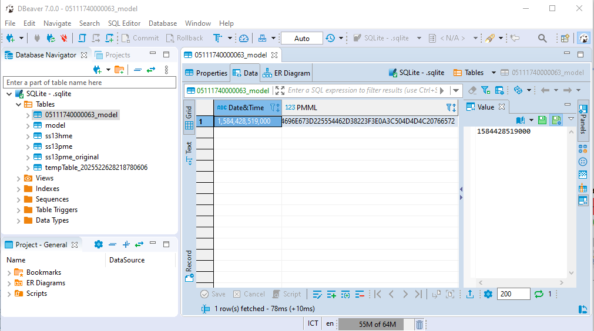

# BIG DATA - KNIME

* DB

    1. Download exercise 4 ([04_WritingToDB](https://hub.knime.com/knime/spaces/Education/latest/04%20KNIME%20Big%20Data%20Course/1_DB/2_Exercises/)).
    1. Download file [newCensus.sqlite](https://hub.knime.com/knime/spaces/Education/latest/04%20KNIME%20Big%20Data%20Course/1_DB/1_Data/).
    1. Buka workflow yang telah diunduh pada langkah pertama.
    1. Ature source file sqlite sesuai dengan lokasi unduh pada langkah kedua.
    1. Tambahkan node DB Update
        * Atur identification berdasarkan kolom serialno
        * Atur update kolom cow

    1. Tambahkan row filter
        * atur column to test menjadi update status
    1. Tambahkan DB Writer
        * atur timestamp dan db connection sebagai input
        * atur tabel target menjadi NRP_model
    1. Tambahkan DB Conncetion Table Writer
        * atur ss13pme_original sebagai tujuan

    Workflow akhir:
    
    Hasil tabel model pada DBeaver:
    

* Hadoop
    1. to do
